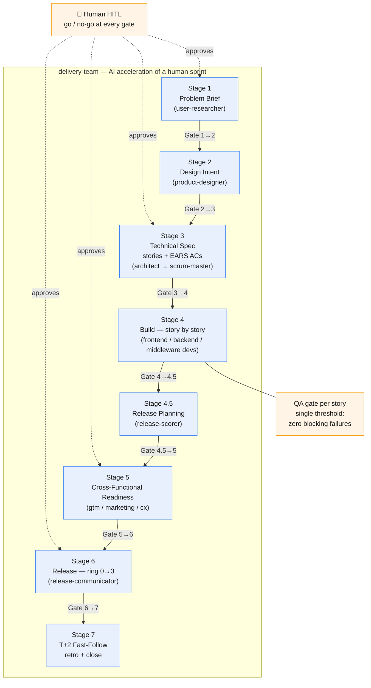
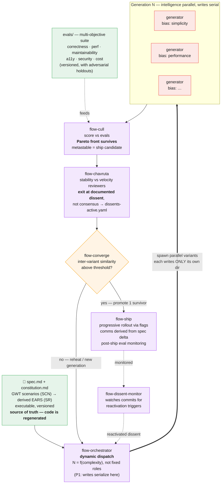

# delivery-team vs flow — two approaches to writing code

Two skill suites in this repository build software with AI, but from opposite starting
assumptions:

- **`delivery-team`** — *AI acceleration of a traditional human sprint.* A linear,
  gated pipeline that mirrors a standard Notion-based process. Each stage maps to a process
  stage; each agent maps to a job title. AI makes every seat faster, but the shape is
  the sprint.
- **`flow`** — *an AI-first approach to building.* The spec is the source of truth and
  code is regenerated output. An orchestrator dynamically dispatches parallel generators,
  a multi-objective evaluator scores them on a Pareto front, and the effort *converges*
  rather than ending on a calendar date.

---

## Diagram 1 — `delivery-team`: AI-accelerated human sprint

A sequential, gated pipeline. One path forward, fixed agent roles, single-threshold
gates, and a human go/no-go at every transition.

**Characteristics:** one path forward · fixed agent roles (= human job titles) ·
time-boxed sprint · single-threshold gates · code is the artifact · stories in prose ·
humans gate each transition.

---

## Diagram 2 — `flow`: AI-first generate-and-converge

No sprint. The spec (EARS, executable, versioned) is the source of truth; code is
regenerated output. The orchestrator dispatches *N* parallel generators where *N* is a
function of complexity, not roles. Each writes only to its own variant directory
(P1: intelligence parallel, writes serial). A multi-objective evaluator scores variants
on a Pareto front; the effort converges rather than ending on a date.

**Characteristics:** spec → regenerated code · dynamic agent count (function-shaped, not
role-shaped) · parallel reads/generation, serialized writes · multi-objective Pareto
evaluation (no single gate) · continuous flow to convergence (no time box) · preserved
dissent with reactivation, not forced consensus.

---

## The contrast in one line

| Axis | `delivery-team` | `flow` |
|---|---|---|
| Mental model | Human sprint, AI in every seat | Population search over a spec |
| Unit of work | Story (prose) | GWT scenario (SCN) → derived EARS (SR) → variants |
| Agents | Fixed roles = job titles | Dynamic count = f(complexity) |
| Progress | Linear stages + gates | Generations until convergence |
| Quality | Single-threshold gate | Multi-objective Pareto front |
| Code | The artifact | Regenerated output of the spec |
| Disagreement | Resolved at a gate | Preserved with reactivation conditions |
| Cadence | Time-boxed sprint | Continuous flow |

---

## Implemented: GWT → EARS layered spec

> **Status: implemented & merged** ([PR #100](https://github.com/your-org/your-repo/pull/100)).
> `flow`'s entry unit of work is now a **Given/When/Then behavioral scenario** (`SCN-{NNN}`)
> that derives the EARS requirements (`SR-{NNN}`) — so the spec is *user/product-focused
> first* rather than engineering-spec-first. See `flow/context/flow-spec-protocol.md` and
> `flow/context/flow-philosophy.md` (P3). A rendered version of this page is at
> [`delivery-team-vs-flow.html`](delivery-team-vs-flow.html); the practitioner's guide is
> [`flow/USAGE.html`](flow/USAGE.html).

Previously `flow-spec-writer` converted NL straight to EARS (`The {system} shall…`), a
*system-centric* grammar. Leading with GWT keeps observable user behavior primary and
defers system decomposition. It also pays off twice: a GWT scenario is already a graded
example, so the scenarios double as `flow`'s eval datasets (P4).

**Recommended shape — a layered spec, not a replacement:**

1. **Behavioral layer (primary): GWT scenarios.** `Given <context>, When <event>,
   Then <observable outcome>.` Authored from the actor's perspective. This is what the
   human reviews and what `flow-narrator` derives comms from.
2. **Normative layer (derived): EARS requirements.** Each scenario expands into the
   `SR-{NNN}` requirements that must hold for it to pass. EARS stays load-bearing and
   parseable — it just sits *downstream* of behavior.
3. **Conformance layer: graders + datasets.** GWT scenarios seed `evals/datasets/`
   directly; EARS requirements still map to graders via `evals/harness.yaml`.

**Why not pure GWT (keep EARS):** non-functional requirements — security, perf, cost,
the very dimensions on `flow`'s Pareto front — are often *not* user-observable events,
so they don't fit `Given/When/Then` cleanly. EARS's ubiquitous/state-driven forms cover
the ambient requirements GWT can't. Use *quality-attribute scenarios* for the few
non-functional cases that do warrant a scenario, and let EARS carry the rest.

**Traceability:** `SCN-{NNN}` (scenario) → `SR-{NNN}` (requirement) → grader+dataset.
This preserves the existing conformance-mapping discipline while adding a product-first
front door.

**Implemented across 12 files:** the spec protocol and P3 philosophy (behavioral layer +
`SCN`/`SR` model), `flow-spec-writer` and the `/flow-spec` command (scenario-first
authoring, `--requirement` fast-path for non-functional SRs), the eval protocol and
`/flow-eval` (scenarios seed correctness datasets), `flow-generator` / `/flow-generate`
(variants implement SCN + SR), `flow-orchestrator`, `flow-narrator` (comms led by SCN),
`/flow-init` (scenario-first initial spec), and the README + USAGE docs.
